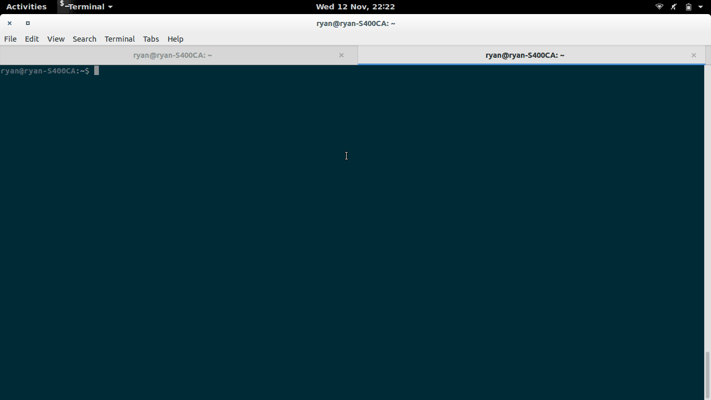

# CI-status v0.1.0  [](https://travis-ci.org/rgrannell1/ci-status)

CI-status is a command-line tool for querying the build status of a travis CI repository. It is primarily meant for use in build scripts and pre-commit 
hooks, as a means of checking if a repository is currently passing its tests.

 </img>

## Installation

```bash
wget -q -O - https://raw.githubusercontent.com/rgrannell1/cistatus/master/install.sh | bash
```

## Usage

CI-status can output an integer flag (`0 => passed`, `n => failed`), the status label used by travis, or a JSON array containing both pieces of information.

```bash
cistatus --json -- 'rgrannell' 'kea'
cistatus --help
```

## Requirements

* Ubuntu or another UNIX (tested on 14.10).
* Node >= v0.10.33
* [Travis CI](https://github.com/pwmckenna/node-travis-ci)

## Licence

The MIT License

Copyright (c) 2014 Ryan Grannell

Permission is hereby granted, free of charge, to any person obtaining a copy of this software and associated documentation files (the "Software"), to deal in the Software without restriction, including without limitation the rights to use, copy, modify, merge, publish, distribute, sublicense, and/or sell copies of the Software, and to permit persons to whom the Software is furnished to do so, subject to the following conditions:

The above copyright notice and this permission notice shall be included in all copies or substantial portions of the Software.

THE SOFTWARE IS PROVIDED "AS IS", WITHOUT WARRANTY OF ANY KIND, EXPRESS OR IMPLIED, INCLUDING BUT NOT LIMITED TO THE WARRANTIES OF MERCHANTABILITY, FITNESS FOR A PARTICULAR PURPOSE AND NONINFRINGEMENT. IN NO EVENT SHALL THE AUTHORS OR COPYRIGHT HOLDERS BE LIABLE FOR ANY CLAIM, DAMAGES OR OTHER LIABILITY, WHETHER IN AN ACTION OF CONTRACT, TORT OR OTHERWISE, ARISING FROM, OUT OF OR IN CONNECTION WITH THE SOFTWARE OR THE USE OR OTHER DEALINGS IN THE SOFTWARE.

## Versioning

Versioning complies with the Semantic Versioning 2.0.0 standard.

http://semver.org/
